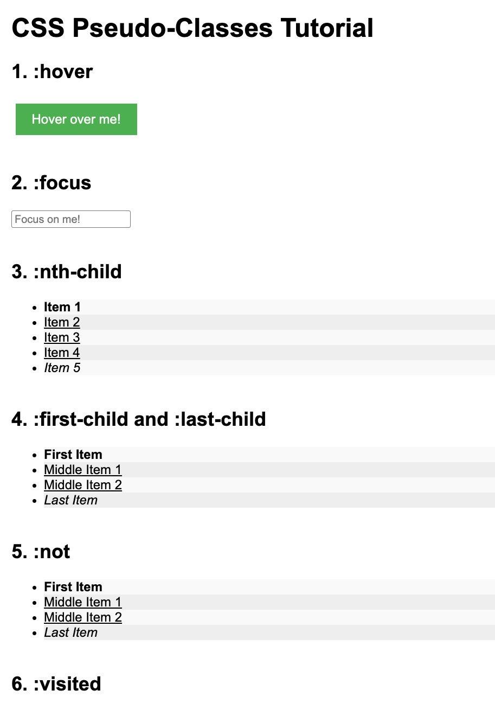

# CSS Pseudo-Classes Tutorial

This is a simple HTML & CSS tutorial used in the **Frontend Now** course at [learnfrontendnow.com](https://learnfrontendnow.com). It demonstrates how to use common CSS pseudo-classes to style interactive and dynamic elements on a webpage.

## What You'll Learn

- How to style elements using `:hover`, `:focus`, and `:active`
- How to target elements using `:first-child`, `:last-child`, `:nth-child`, and `:not`
- How to visually distinguish `:visited` links
- How to combine pseudo-classes for more powerful styling

## Preview

This is a live visual playground for learning and testing CSS pseudo-classes.

## How to Use

1. Clone this repository or download the HTML file.
2. Open `index.html` in your browser.
3. Interact with the page elements to see the pseudo-classes in action.

## Recommended For

- Beginners learning CSS
- Students of the [Frontend Now](https://learnfrontendnow.com) course
- Anyone wanting a quick refresher on CSS pseudo-classes

## License

This tutorial is provided as-is for educational purposes for Frontend Now students only.
